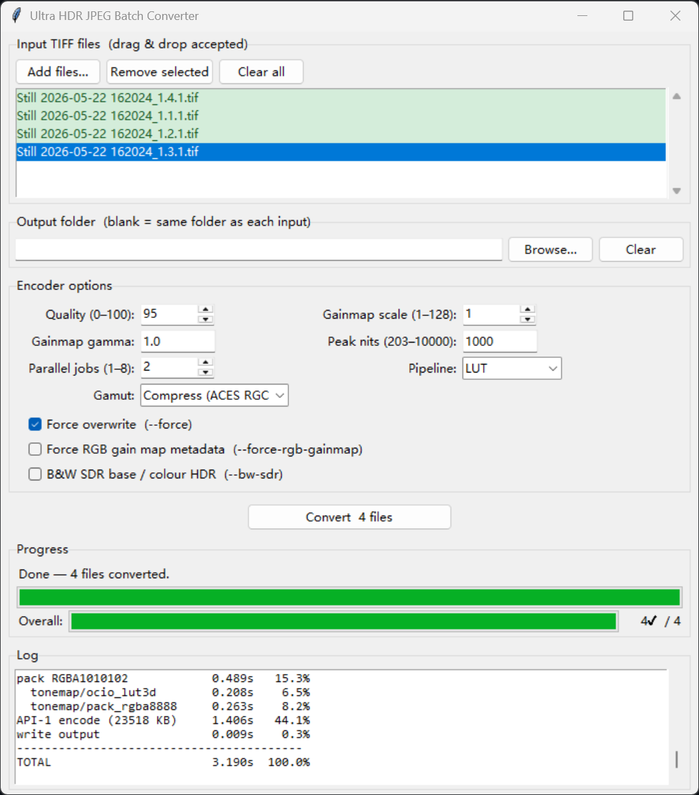

# BT.2020 PQ → Google Ultra HDR JPEG

Converts a single-layer **PQ HDR TIFF** (16-bit RGB, BT.2020 primaries) into a **Google Ultra HDR JPEG** (ISO 21496-1 gain map + legacy `hdrgm:` XMP) using stock [google/libultrahdr](https://github.com/google/libultrahdr) — no local patches.

The output carries a multi-channel (RGB) gain map with both renditions in Display P3 (`use_base_cg=true`), making it compatible with iOS Photos, macOS Preview, and Adobe Lightroom.

## Requirements

### To run the pipeline

| Dependency | Notes |
|---|---|
| Python ≥ 3.12 | via `uv` |
| [uv](https://docs.astral.sh/uv/) | package/venv manager |
| Native library | see platform notes below |

Python package dependencies (`colour-science`, `numpy`, `opencolorio`, `tifffile`) are declared in `pyproject.toml` and installed automatically by `uv sync`. No manual `pip install` step needed.

`tkinter` (used by `gui.py`) is part of the Python standard library — no extra install.

**Windows** — `uhdr.dll` + `jpeg62.dll` are pre-built and committed to the repo; no build step required.

**macOS** — `libuhdr.dylib` + `libjpeg.62.dylib` are pre-built and committed to the repo; no build step required.

### To rebuild the native library from source

Only needed if you want to update or patch the native source. Pre-built libraries for Windows and macOS are already committed to the repo.

#### Windows prerequisites

| Dependency | Required path / version |
|---|---|
| Visual Studio 2022 Community | `C:\Program Files\Microsoft Visual Studio\18\Community` |
| [NASM](https://www.nasm.us/) | `C:\Program Files\NASM` |
| CMake + Ninja | on `PATH` (installed with VS or separately) |
| libjpeg-turbo source tree | `libjpeg-turbo/` subdirectory (cloned separately, not tracked) |
| libultrahdr source tree | `libultrahdr/` subdirectory (cloned separately, not tracked) |

#### macOS prerequisites

| Dependency | How to install |
|---|---|
| Xcode Command Line Tools | `xcode-select --install` |
| CMake | `brew install cmake` |
| Ninja (optional, speeds up build) | `brew install ninja` |
| libjpeg-turbo source tree | cloned automatically by the build script |
| libultrahdr source tree | cloned automatically by the build script |

## Quick start

```bash
# CLI — single file
uv run python convert.py input.tif output.uhdr.jpg

# GUI — batch conversion
uv run python gui.py
```

The output path is printed to stdout; per-step timing is written to stderr.

## CLI usage

```
uv run python convert.py <input.tif> <output.jpg> [options]

positional arguments:
  input            16-bit BT.2020 PQ TIFF (RGB, full range)
  output           Output Ultra HDR JPEG path

options:
  --quality N      JPEG quality 0-100 for base image and gain map (default: 95)
  --gainmap-scale N
                   Gain map downscale factor 1-128 (default: 1, full resolution)
  --gainmap-gamma G
                   Encoding gamma applied to the gain map (default: 1.0)
  --peak-nits N    Target HDR display peak in nits 203-10000 (default: 1000)
  --force, -f      Overwrite output if it already exists
  --verbose, -v    Extra diagnostic output
```

## GUI usage

Launch the batch converter:

```bash
uv run python gui.py
```



### Input TIFF files

Click **Add files…** to open a file picker and select one or more `.tif`/`.tiff` files. The list supports multi-selection (Ctrl-click, Shift-click). To remove entries, select them and click **Remove selected**, or click **Clear all** to reset the list. The **Convert** button shows the number of queued files and stays disabled until at least one file is added.

### Output folder

Leave the field blank to write each output file next to its source TIFF (e.g. `foo.tif` → `foo.uhdr.jpg` in the same directory). Click **Browse…** to pick a different folder, or type a path directly. **Clear** resets it to the default (same-folder) behaviour.

### Encoder options

| Option | Range | Default | Effect |
|---|---|---|---|
| Quality | 0–100 | 95 | JPEG quality for the base image and gain map |
| Gainmap scale | 1–128 | 1 | Gain map downscale factor (1 = full resolution) |
| Gainmap gamma | > 0 | 1.0 | Encoding gamma applied to the gain map |
| Peak nits | 203–10000 | 1000 | Target HDR display peak brightness |
| Parallel jobs | 1–8 | 2 | Number of files encoded simultaneously |
| Force overwrite | on/off | off | Overwrite existing output files (equivalent to `--force`) |

### Converting

Click **Convert N files** to start. The button changes to **Cancel** while a batch is running; clicking it skips any not-yet-started files and lets in-flight encodes finish. Progress is shown in two bars: a per-file activity bar (animates while encodes are running) and an overall files-completed bar. The log panel below shows each file's per-step timing table as reported by `convert.py`.

## Building the native library

`libultrahdr` must be configured with `-DUHDR_WRITE_XMP=ON` (all build scripts already set this) so the output carries the legacy `hdrgm:` XMP for older viewer compatibility.

### Windows

Both batch files call `vcvars64.bat` from Visual Studio 2022 Community and install intermediate files to `C:\msvcinstalls`.

```cmd
:: 1. Build libjpeg-turbo (installs to C:\msvcinstalls)
scripts\_build_jpegturbo.bat

:: 2. Build libultrahdr against the libjpeg-turbo install
scripts\_build_libultrahdr.bat
```

After building, copy `libultrahdr\build\uhdr.dll` and `C:\msvcinstalls\bin\jpeg62.dll` next to `uhdr_ctypes.py`.

### macOS

Both source trees are cloned automatically from the parent of the project directory if they are not already present. Intermediate libraries install to `~/uhdr-deps`.

```bash
# 1. Build libjpeg-turbo (installs to ~/uhdr-deps)
bash scripts/_build_jpegturbo_macos.sh

# 2. Build libultrahdr, fix rpath, copy dylibs next to uhdr_ctypes.py
bash scripts/_build_libultrahdr_macos.sh
```

The libultrahdr script rewrites the embedded JPEG dependency in `libuhdr.dylib` to `@loader_path/libjpeg.62.dylib` using `install_name_tool`, so both dylibs resolve each other by relative path without `DYLD_LIBRARY_PATH`.

## Pipeline overview

```
input.tif  (uint16 BT.2020 PQ)
  │
  ▼
BT.2020 PQ → Display P3 PQ
  ST.2084 EOTF → BT.2020→ACEScg (Bradford) → ACES 1.3 RGC
  → ACEScg→Display P3 (Bradford) → clip → ST.2084 OEOTF
  (single fused OCIO CPU pass, AVX-vectorised)
  │
  ▼  p3_pq uint16 (H×W×3)
  │
  ├─► App-0 encode (HDR-only)
  │     uhdr_enc_set_raw_image(p3_pq, HDR_IMG)
  │     → UHDR JPEG → extract_primary_jpeg() → sdr_jpeg (P3 SDR base)
  │
  └─► API-3 encode (raw HDR + compressed SDR → RGB gain map)
        uhdr_enc_set_raw_image(p3_pq, HDR_IMG)
        uhdr_enc_set_compressed_image(sdr_jpeg, SDR_IMG)
        uhdr_enc_set_using_multi_channel_gainmap(1)
        → output.uhdr.jpg
```

**Color pipeline** (`color.py`): a single OCIO `GroupTransform` fuses ST.2084 EOTF, two 3×3 gamut matrices (BT.2020→ACEScg and ACEScg→P3 via Bradford CAT), the ACES 1.3 Reference Gamut Compression fixed function, and the ST.2084 inverse EOTF into one AVX-vectorised CPU pass. Far-out-of-gamut hues are soft-compressed (RGC) rather than hard-clipped.

**Two-pass encode**: the App-0 pass lets libultrahdr tone-map the PQ image internally and produce the SDR primary JPEG. That JPEG is reused as the compressed SDR input in the API-3 pass, so the primary image is never re-encoded (no double-encode quality loss).

## Diagnostic tools

All tools use only the standard library plus the same Python packages already declared in `pyproject.toml` — no separate install.

```bash
# JPEG marker map (primary image only)
uv run python tools/_inspect_jpg.py  <file.uhdr.jpg>

# Full marker walk: primary + gain-map JPEG, ISO 21496-1 metadata decoded
uv run python tools/_inspect_full.py <file.uhdr.jpg>

# XMP packets + raw ISO 21496-1 hex dump
uv run python tools/_dump_meta.py    <file.uhdr.jpg>

# Extract and display ICC profiles from primary + gain-map segments
uv run python tools/_dump_icc.py     <file.uhdr.jpg>

# Side-by-side ICC profile comparison between two JPEGs
uv run python tools/_compare_icc.py  <a.uhdr.jpg> <b.uhdr.jpg>

# Downscale a BT.2020 PQ TIFF in linear light (for resolution-limit testing)
uv run python tools/_downscale_tiff.py <in.tif> <out.tif> <WxH>
```

```cmd
:: ctypes load test + DLL dependency check (dumpbin)
scripts\_smoke.bat

:: Decode round-trip test via ultrahdr_app.exe -m 1
scripts\_decode_check.bat
```

## Module reference

| File | Role |
|---|---|
| `convert.py` | CLI entry point, `pack_rgba1010102`, App-0 and API-3 encoder calls, `extract_primary_jpeg` |
| `gui.py` | Batch GUI — wraps `convert.py` via `subprocess`, parallel jobs, progress/log display |
| `color.py` | `bt2020_pq_to_p3_pq_uint16`: BT.2020 PQ → Display P3 PQ with ACES 1.3 RGC |
| `uhdr_ctypes.py` | `ctypes` bindings for libultrahdr (`uhdr.dll` / `libuhdr.dylib`); `UhdrRawImage` / `UhdrCompressedImage` structs |

## Output file structure

An Ultra HDR JPEG is two concatenated JPEGs (primary SDR base then gain-map secondary) joined by an MPF `APP2` marker. Key metadata blocks:

- **APP1 XMP** on the primary — `hdrgm:` namespace (legacy Adobe gain map format)
- **APP2 `urn:iso:std:iso:ts:21496:-1`** on the gain-map JPEG — ISO 21496-1 binary metadata (per-channel `gainMapMin/Max`, `gamma`, headroom values, multichannel flag, `use_base_colour_space`)
- **APP2 `ICC_PROFILE`** — Display P3 ICC profiles on both primary and gain-map segments

## License

This pipeline is a thin Python wrapper around [google/libultrahdr](https://github.com/google/libultrahdr) (Apache 2.0) and [libjpeg-turbo](https://libjpeg-turbo.org/) (BSD/IJG). Refer to those projects for their respective licenses.
